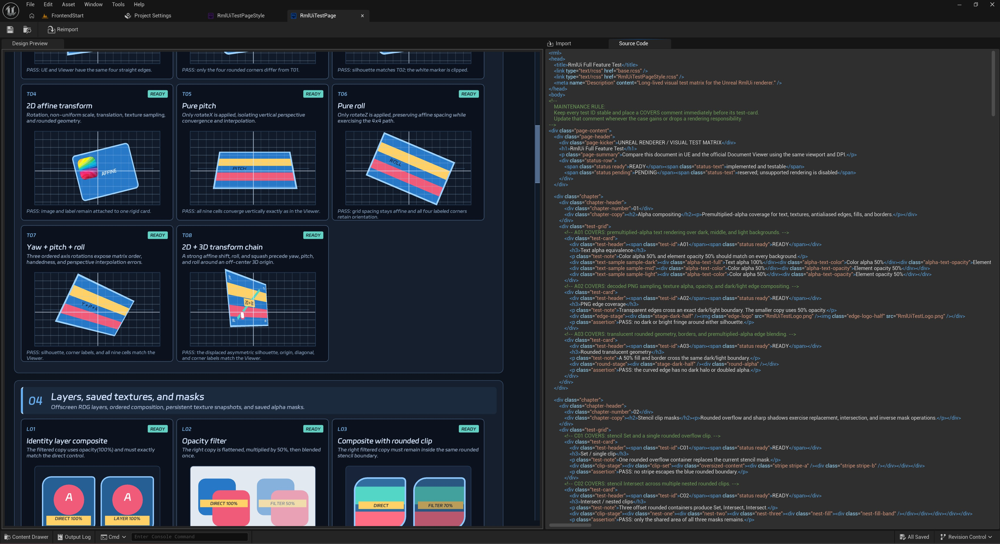

[中文](./README_cn.md)
 
 

  

  An HTML and CSS-style UI plugin for Unreal Engine.
   
   
  

  <a href="#overview">Overview</a>
  | <a href="#documentation">Documentation</a>
  | <a href="#roadmap">Roadmap</a>

 

# Overview

**MarkupUI** brings HTML and CSS-style UI authoring to Unreal Engine. It is designed for UI that benefits from readable document structure, reusable styles, and a clear separation between interface content and presentation.

Build interfaces with markup and stylesheets, then keep them close to the Unreal workflow your project already uses.

## Highlights

- **HTML/CSS-style authoring** — Use markup, selectors, cascading styles, variables, Flex layout, transitions, animations, and transforms to describe UI.
- **Native Unreal workflow** — Work with HTML documents and CSS stylesheets as Unreal assets, with standard import and reimport support.
- **Slate integration** — Use MarkupUI as part of an Unreal UI, with mouse, keyboard, text input, focus, and cursor behavior available to authored interfaces.
- **Flexible resources** — Load documents, styles, fonts, and images from Unreal assets or a disk-based content layout.
- **Visual foundation** — Support practical UI rendering features such as clipping, transforms, compositing, filters, and saved visual resources, while documenting any unsupported visual syntax clearly.

## Documentation

- [Resource paths and root directory](Usage/Resource-Paths.md)
- [Using Unreal asset fonts](Usage/Unreal-Asset-Fonts.md)
- [Blueprint DOM](Usage/Blueprint-Dom.md)
- [Tracing usage guide](Usage/Tracing.md)

## Roadmap

MarkupUI uses the MarkupUI SDK for HTML and CSS rendering in Unreal projects. Current work continues across visual regression coverage, performance measurement, and Unreal integration.

The project favors accurate, explicit behavior: features that are not ready for reliable output should be documented as unavailable instead of silently producing a different result.

## Acknowledgements

MarkupUI uses the [MarkupUI SDK](https://github.com/endink/MarkupUI-Sdk).
