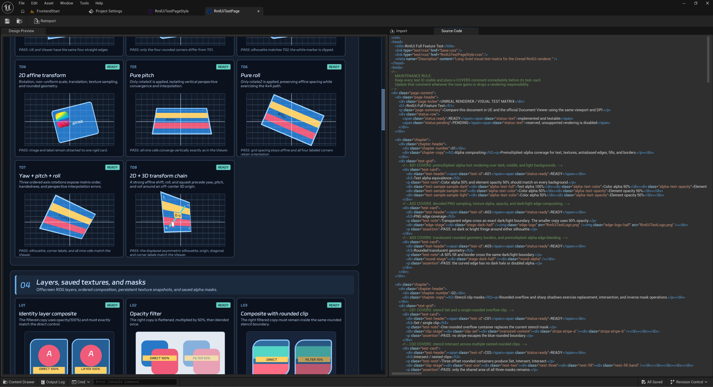

[English](./README.md)
 
 

  

  一个为 Unreal Engine 提供 HTML 与 CSS 风格 UI 创作体验的插件。
   
   
  

  <a href="#概览">概览</a>
  | <a href="#文档">文档</a>
  | <a href="#路线图">路线图</a>

 

# 概览

**MarkupUI** 为 Unreal Engine 带来 HTML 与 CSS 风格的 UI 创作体验。它适合需要清晰界面结构、可复用样式，以及内容与视觉呈现各自易于维护的 UI。

使用标记语言描述界面内容，以样式表表达视觉语言，并让它们自然融入你现有的 Unreal 工程工作流。

## 核心能力

- **HTML/CSS 风格创作** — 使用标记语言、选择器、层叠样式、变量、Flex 布局、过渡、动画与变换描述 UI。
- **原生 Unreal 工作流** — 将 RML 文档与 RCSS 样式表作为 Unreal 资产使用，并获得标准的导入和重导入支持。
- **Slate 集成** — 将 MarkupUI 放入 Unreal UI，界面可获得鼠标、键盘、文本输入、焦点和光标交互行为。
- **灵活的资源来源** — 从 Unreal 资产或磁盘内容目录加载文档、样式、字体与图片。
- **扎实的视觉基础** — 支持裁剪、变换、合成、filter 与可保存的视觉资源等实用 UI 能力；尚未支持的视觉语法会明确说明。

## 文档

- [资源路径与根目录](Usage/Resource-Paths.md)
- [使用 Unreal 资产字体](Usage/Unreal-Asset-Fonts.md)
- [RCSS 渲染支持与路线图](RCSS-Rendering-Support-Roadmap.md)
- [渲染性能诊断](Rendering-Performance.md)
- [渲染 Stat 与性能分析](Rendering-Stat-Profiling.md)

## 路线图

MarkupUI 正在持续完善高级 RCSS 视觉能力在 Unreal 项目中的可靠性。当前方向包括 mask 组合、box-shadow、gradient、自定义 shader、视觉回归覆盖与性能度量。

项目坚持准确且明确的行为：尚未能稳定输出正确结果的功能，会被清楚地标记为不可用，而不会悄悄产生不同的画面。请阅读 [RCSS 渲染支持与路线图](RCSS-Rendering-Support-Roadmap.md) 了解当前范围与后续方向。

## 致谢

MarkupUI 基于 [RmlUi](https://github.com/mikke89/RmlUi) 构建。感谢 RmlUi 社区为轻量且高表达力的 C++ UI 中间件所做的长期投入。
